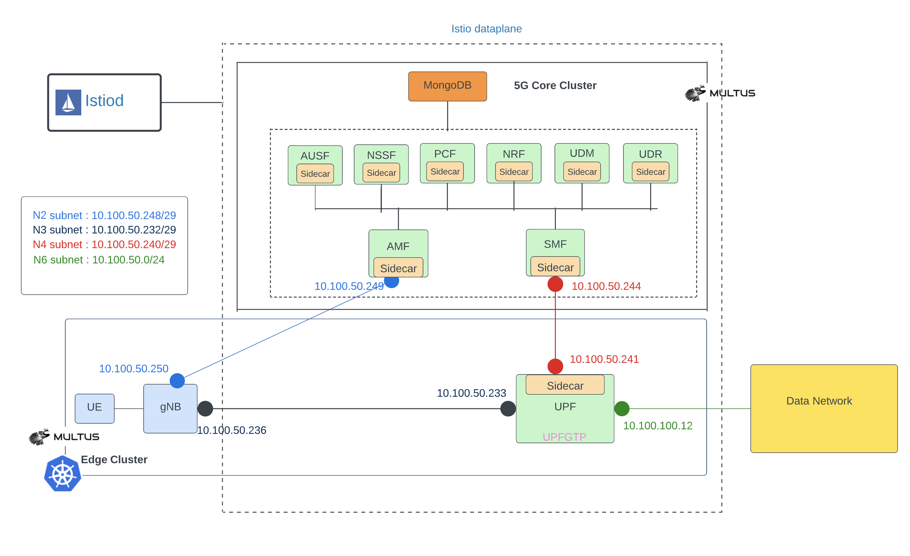

# Excluding Istio interfaces for 5G core 

This document contains instructions how to deploy [free5gc](https://www.free5gc.org/) on a single Kubernetes cluster using [Helm charts](https://github.com/Orange-OpenSource/towards5gs-helm). The free5gc control and data plane are deployed on a `cp` and `dp` namespaces, respectively. Both namespaces have Istio sidecar injection enabled. However, dataplane network interfaces `upfgtp` and `n6` interfaces are excluded from the Istio service mesh. That means Istio sidecar does not monitor traffic through `upfgtp` and `n6` interfaces, which improves the latency of data network traffic in 5G network.



## Install gtpg5g kernel module

Each worker node needs [gtp5g kernel module](https://github.com/free5gc/gtp5g).

Due to the evolution of Linux kernel, this module would not work with every kernel version. Please run this module with kernel version 5.0.0-23-generic, upper than 5.4 (Ubuntu 20.04.1) or RHEL8.
```console
git clone -b v0.3.1 https://github.com/free5gc/gtp5g.git
cd gtp5g
make
sudo make install
```

## Add Helm charts

```console
helm repo add towards5gs https://raw.githubusercontent.com/Orange-OpenSource/towards5gs-helm/main/repo/
helm repo update
```

## Install Calico


Apply customised calico resource yaml file (we need natOutgoing and containerIPForwarding enabled for 5GC)
>NOTE: cidr should match with cluster cidr.

```console
cat <<EOF |kubectl create -f -
# This section includes base Calico installation configuration.
# For more information, see: https://projectcalico.docs.tigera.io/master/reference/installation/api#operator.tigera.io/v1.Installation
apiVersion: operator.tigera.io/v1
kind: Installation
metadata:
  name: default
spec:
  # Configures Calico networking.
  calicoNetwork:
    # Note: The ipPools section cannot be modified post-install.
    ipPools:
    - blockSize: 26
      cidr: 192.168.0.0/16
      encapsulation: VXLANCrossSubnet
      natOutgoing: Enabled
      nodeSelector: all()
    containerIPForwarding: Enabled
---

# This section configures the Calico API server.
# For more information, see: https://projectcalico.docs.tigera.io/master/reference/installation/api#operator.tigera.io/v1.APIServer
apiVersion: operator.tigera.io/v1
kind: APIServer
metadata:
  name: default
spec: {}
EOF

kubectl create -f https://raw.githubusercontent.com/projectcalico/calico/v3.24.1/manifests/tigera-operator.yaml 
```

## Install Istio

Follow istio installation instructions from [here](https://istio.io/latest/docs/setup/install/istioctl)

```console
istioctl install -y
```

Create `dp` and `cp` namespaces and label `dp` and `cp` for sidecar injection.

```console
kubectl create ns dp
kubectl create ns cp
kubectl label ns cp istio-injection=enabled
kubectl label ns dp istio-injection=enabled
```

Create Istio gateway and virtual service for free5gc Web-UI.

```console
cat <<EOF |kubectl create -f -
apiVersion: networking.istio.io/v1alpha3
kind: Gateway
metadata:
  name: webui-gateway
spec:
  selector:
    istio: ingressgateway
  servers:
  - port:
      number: 80
      name: http
      protocol: HTTP
    hosts:
    - "*"
---
apiVersion: networking.istio.io/v1alpha3
kind: VirtualService
metadata:
  name: webui
spec:
  hosts:
  - "*"
  gateways:
  - webui-gateway
  http:
  - route:
    - destination:
        host: webui-service.cp.svc.cluster.local
        port:
          number: 5000
EOF
```

## Install Multus

Multus CNI is needed to have multiple interfaces on 5G CNFs (pods).


```
kubectl apply -f https://raw.githubusercontent.com/k8snetworkplumbingwg/multus-cni/33c0d1bd86b22106442c84b8d9e28945cf6182e3/deployments/multus-daemonset-thick.yml
```

## Install free5gc

>NOTE: you may need to tune your network interface names and data network subnet. Check [this](https://github.com/Orange-OpenSource/towards5gs-helm/tree/main/charts/free5gc#networks-configuration) documentation how to do that.

In this example the interface name is `ens3` (instead of the default `eth0`), data network (n6) configuration should match your host interface (ens3) details. E.g: if your host interface (ens3) subnet ip is 10.237.72.0/24 and gateway address is 10.237.72.1. Then n6 interface details should be like below. `global.n6network.subnetIP`=<"10.237.72.0">, `global.n6network.gatewayIP`=<"10.237.72.1"> and `upf.n6if.ipAddress`=<"10.237.72.XX">. Pick a free ip address in that subnet.

Install free5gc data plane (UPF) to `dp` namespace. 

> NOTE: N6 network `cidr` default is 24 and is omited below. `upf.n6if.ipAddress` is an extra ip address(not host ip) you need reserve in advance. Contact network administrator in case this address is blocked by certain security rule in your network.

```console
helm upgrade --install intel -n dp \
--set global.n4network.masterIf=ens3 \
--set global.n3network.masterIf=ens3 \
--set global.n6network.masterIf=ens3 \
--set global.n6network.subnetIP="10.237.72.0" \
--set global.n6network.gatewayIP="10.237.72.1" \
--set upf.n6if.ipAddress="10.237.72.20" \
--set upf.podAnnotations."traffic\.sidecar\.istio\.io\/excludeInterfaces"="upfgtp\, n6" \
towards5gs/free5gc-upf
```

>Note: Istio unable to inject the sidecar to upf pod. It is showing " Warning  Unhealthy 18s (x10 over 45s)  kubelet Readiness probe failed: Get "http://192.168.47.205:15021/healthz/ready": context deadline exceeded (Client.Timeout exceeded while awaiting headers)". A temporary hack would be edit deployment of upf and add an annotation `status.sidecar.istio.io/port: "0"` and wait for pod to restart.

Install free5gc control plane to `cp` namespace. 

```console
helm upgrade --install intel -n cp \
--set deployUPF=false \
--set deployWEBUI=false \
--set mongodb.persistence.enabled=false \
--set global.n2network.masterIf=ens3 \
--set global.n3network.masterIf=ens3 \
--set global.n4network.masterIf=ens3 \
--set global.n6network.masterIf=ens3 \
--set global.n9network.masterIf=ens3 \
towards5gs/free5gc
```

Install free5gc WebUI to `cp` namespace. 

Set `WEBUI_SERVICE_TYPE` as follows depending if you are installing with or without Istio.

```console
# With Istio
export WEBUI_SERVICE_TYPE=LoadBalancer/NodePort
# Without Istio 
export WEBUI_SERVICE_TYPE=NodePort
```

```console
helm upgrade --install webui -n cp \
--set webui.service.type=$WEBUI_SERVICE_TYPE \
towards5gs/free5gc-webui
```

## Install Verification

The control plane deployment should look like this. Note the two containers per pod due to the Istio sidecars.

```console
kubectl get pod -n cp
NAME                                         READY   STATUS    RESTARTS   AGE
intel-free5gc-amf-amf-95f88965b-qvvsn        2/2     Running   0          21h
intel-free5gc-ausf-ausf-7994587f88-5nsld     2/2     Running   0          21h
intel-free5gc-nrf-nrf-67d7d8cf66-kn4p9       2/2     Running   0          21h
intel-free5gc-nssf-nssf-5cb78f9b9c-xm7vn     2/2     Running   0          21h
intel-free5gc-pcf-pcf-6cd66d46d4-s8n2f       2/2     Running   0          21h
intel-free5gc-smf-smf-c7d9fcffd-j7lv5        2/2     Running   0          21h
intel-free5gc-udm-udm-58b4d54bbf-dxmbs       2/2     Running   0          21h
intel-free5gc-udr-udr-78d5484d58-htc9m       2/2     Running   0          21h
intel-free5gc-webui-webui-5f975d95fd-dzrtj   2/2     Running   0          21h
mongodb-0                                    2/2     Running   0          21h
```

The data plane deployment should look like this.

```console
kubectl get pod -n dp
NAME                                     READY   STATUS    RESTARTS   AGE
intel-free5gc-upf-upf-67ddd9967d-gklrr   2/2     Running   0          21h
```

Check the Web UI access. 

> NOTE: the below requires that your cluster supports service type `LoadBalancer`. Otherwise you need to use some other mechanism to access the Web UI.

```console
IP=$(kubectl get svc -n istio-system istio-ingressgateway -o jsonpath="{.status.loadBalancer.ingress[0].ip}")
curl $IP
```

Use a web bowser to access the URL `http://${IP}`, login credentials are `admin/free5gc`. Add a subscriber (UE).


Install `ueransim` simulator on a newly created `sim` namespace.
> NOTE: subscriber adding is necessary before sim component installation, if uesimtun0 created failed, try uninstall sim with `helm uninstall sim -n sim` and redeploy to fix it.

```console
helm install sim -n sim --create-namespace \
--set global.n2network.masterIf=ens3 \
--set global.n3network.masterIf=ens3 \
towards5gs/ueransim
```

The simulator deployment should look like this.

```console
kubectl get pod -n sim
NAME                                READY   STATUS    RESTARTS   AGE
sim-ueransim-gnb-6dffd9c777-qlz7l   1/1     Running   0          64m
sim-ueransim-ue-6cf9b565d8-skp54    1/1     Running   0          64m
```

## Testing

Access exteral services from UE simimulator via data network.

```console
# Get the UE Pod name by running:
export POD_NAME=$(kubectl get pods --namespace sim -l "component=ue" -o jsonpath="{.items[0].metadata.name}")
# Check that uesimtun0 interface has been created by running these commands:
kubectl --namespace sim exec -it $POD_NAME -- ip address
# Try to access internet from the UE by running:
kubectl --namespace sim exec -it $POD_NAME -- ping -I uesimtun0 corp.intel.com
```

You should see our NTP server responding ;) 

To test istio's excludeInterfaces feature, run the httpbin server anywhere in your network.

```console
docker run -p 8080:80 kennethreitz/httpbin
```
# Try to access it from the UE by running:

```console
kubectl --namespace sim exec -it $POD_NAME -- curl --interface uesimtun0 -v http://<IP_ADDR_OF_HTTPBIN_HOST>:8080/headers
*   Trying 10.237.72.78...
* TCP_NODELAY set
* Connected to 10.237.72.78 (10.237.72.78) port 8080 (#0)
> GET /headers HTTP/1.1
> Host: 10.237.72.78:8080
> User-Agent: curl/7.58.0
> Accept: */*
>
< HTTP/1.1 200 OK
< Server: gunicorn/19.9.0
< Date: Fri, 09 Dec 2022 11:51:09 GMT
< Connection: keep-alive
< Content-Type: application/json
< Content-Length: 111
< Access-Control-Allow-Origin: *
< Access-Control-Allow-Credentials: true
<
{
  "headers": {
    "Accept": "*/*",
    "Host": "10.237.72.78:8080",
    "User-Agent": "curl/7.58.0"
  }
}
* Connection #0 to host 10.237.72.78 left intact
```

As we exlcluded upf network interfaces upfgtp and n6, the data doesn't go through the istio's sidecar. We can see it from the reply. If the reply comes back through istio's sidecar, few extra fields will be added to the reply. e.g. "x-envoy-upstream-service-time", "server: istio-envoy" and "x-envoy-decorator-operation".
