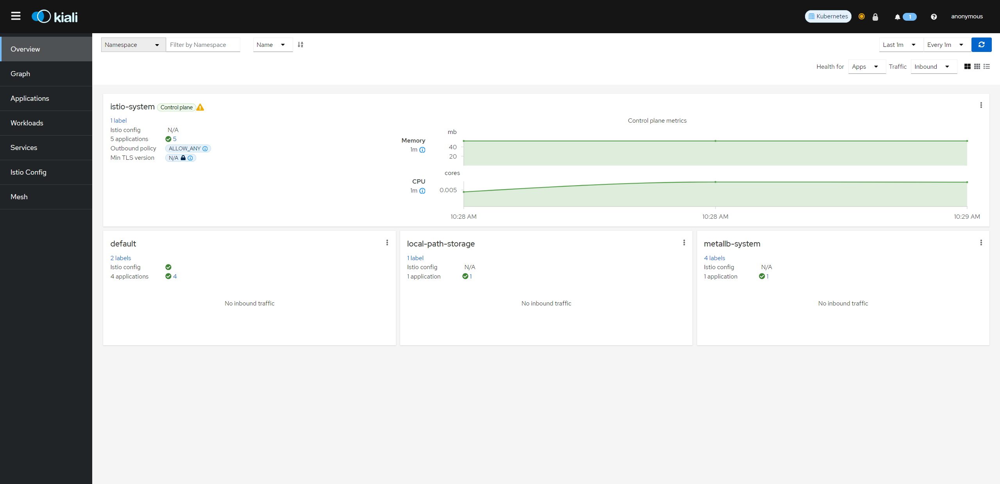
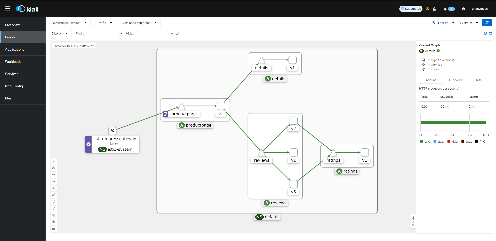
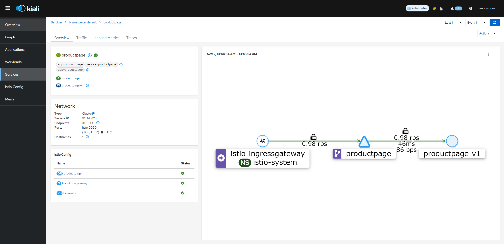
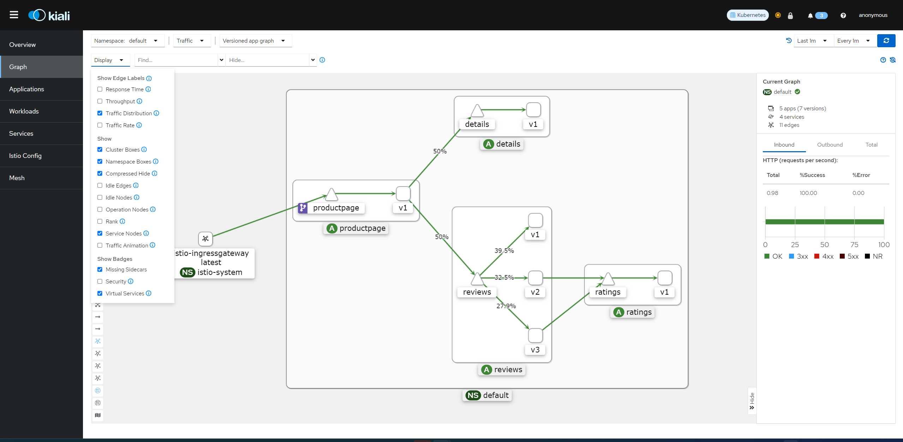
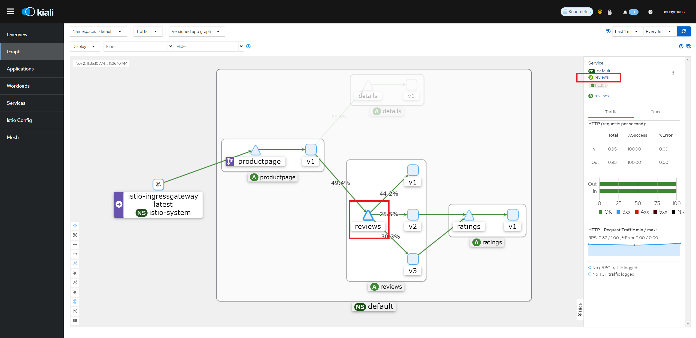
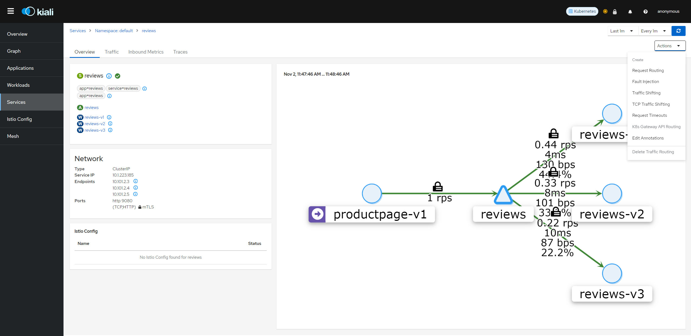
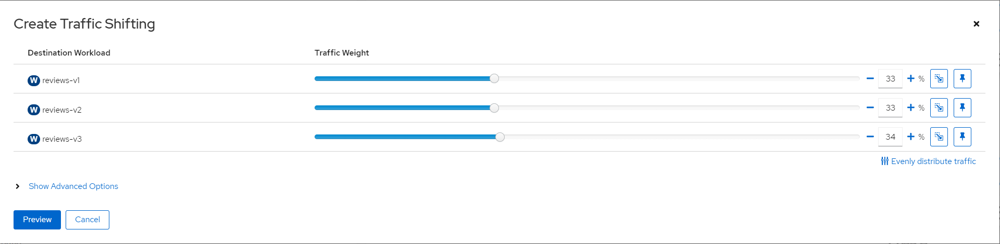
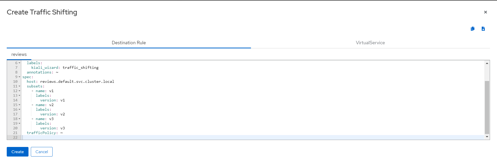
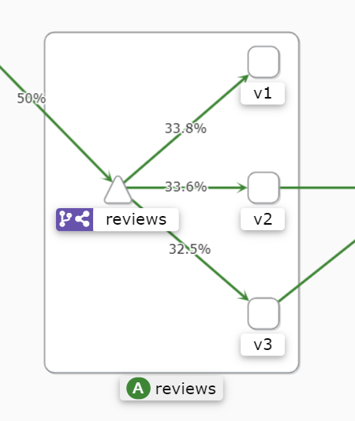

# Kiali

[Kiali](https://kiali.io/) is an observability console for Istio with service mesh configuration capabilities.
It helps you to understand the structure of your service mesh by inferring the topology, and also provides the health of your mesh.
Kiali provides detailed metrics, and a basic Grafana integration is available for advanced queries.
Distributed tracing is provided by integrating [Jaeger](#install-jaeger).

## Prerequisite

Before you install Kiali you must have already installed Istio along with its telemetry storage addon (i.e. [Prometheus](#install-prometheus)). You might also consider installing Istio’s optional tracing addon (i.e. Jaeger) and optional Grafana addon but those are not required by Kiali.

## Installation

### Install Prometheus

> *skip this step if prometheus already deployed*

`kubectl apply -f https://raw.githubusercontent.com/intel/istio/release-1.19-intel/samples/addons/prometheus.yaml`

### Install Jaeger

> *Optional. kiali integrated with jaeger will provide more visiablity for service mesh*

`kubectl apply -f https://raw.githubusercontent.com/intel/istio/release-1.19-intel/samples/addons/jaeger.yaml`

### Install Kiali

`kubectl apply -f https://raw.githubusercontent.com/intel/istio/release-1.19-intel/samples/addons/kiali.yaml`

Or following the [Kiali Installation Guide](https://kiali.io/docs/installation/installation-guide/) documentation to deploy Kiali into your cluster.

## Generating a graph

1. To verify the service is running in your cluster, run the following command:

   `kubectl -n istio-system get svc kiali`

2. To open the Kiali UI, execute the following command in your Kubernetes environment:

    `istioctl dashboard kiali`

3. View the overview of your mesh in the Overview page that appears immediately after you log in. The Overview page displays all the namespaces that have services in your mesh. The following screenshot shows a similar page:

4. To view a namespace graph, Select the Graph option in the kebab menu and choose namespaces you'd like to inspect . The kebab menu is at the top right of card and looks like 3 vertical dots. Click it to see the available options. The page looks similar to:

## Examining Istio configuration

The left menu options lead to list views for **Applications**, **Workloads**, **Services** and **Istio Config**. The following screenshot shows ***productpage*** services overview information:

## Traffic Shifting

You can use the Kiali traffic shifting wizard to define the specific percentage of request traffic to route to two or more workloads.

1. View the **Versioned app graph** of the graph.

   * Make sure you have enabled the **Traffic Distribution** Edge Label **Display** option to see the percentage of traffic routed to each workload.

   * Make sure you have enabled the Show **Service Nodes Display** option to view the service nodes in the graph.

2. Focus on the **reviews** service within the graph by clicking on the **reviews** service (triangle) node. Notice the **reviews** service traffic is evenly distributed to the three **reviews** workloads v1, v2 and v3.

3. Click the **reviews** link found in the side panel to go to the detail view for the **reviews** service.
   
4. From the **Actions** drop down menu, select **Traffic Shifting** to access the traffic shifting wizard(If **Traffic Shifting** is unavailable, may need **Delete Traffic Routing** first).

5. Drag the sliders to specify the percentage of traffic to route to each workload. For example, 33% to each version.

6. Click the **Preview** button to view the YAML that will be generated by the wizard.
   

7. Click the **Create** button and confirm to apply the new traffic settings.

8. Click Graph in the left hand navigation bar to return to the graph. Notice that the **reviews** service node is now badged with the ***virtual service*** icon.

9. Send requests to the bookinfo application. For example, to send one request per second, you can execute this command if you have watch installed on your system:

    `watch -n 1 curl -o /dev/null -s -w %{http_code} $GATEWAY_URL/productpage`

10. After a few minutes you will notice that the traffic percentage will reflect the new traffic route, thus confirming the fact that your new traffic route is successfully routing to 3 versioned **reviews** evenly.

