# Use Meshery to deploy and manage Istio with Intel Features

## Meshery Introduction

Meshery is the open source, cloud native management plane that enables the adoption, operation, and management of Kubernetes, any service mesh, and their workloads.

### The benefit to use Meshery to deploy and manage Istio

Meshery offers us with an intuitive, visual, and convenient way to deploy Intel Accelerated Istio with one button and run performance tests to intuitively demonstrate the performance acceleration of Intel Istio.

## Architecture

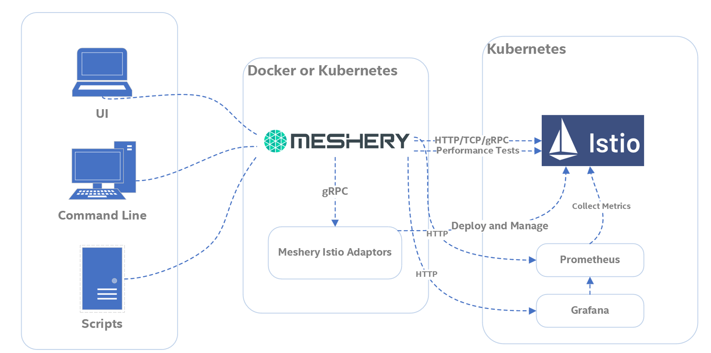

## Install Meshery

You can use one of below 3 options:

**Install on Kubernetes**:

```
$ curl -L https://meshery.io/install | PLATFORM=kubernetes bash -
```

**Install on Docker**:

```
$ curl -L https://meshery.io/install | PLATFORM=docker bash -  
```
 
**Install via Docker Compose**:

If you want more personalized configurations, such as setting proxies, please edit “.meshery/meshery.yaml”, then setup Meshery via docker compose:

```
$ docker compose -f ~/.meshery/meshery.yaml up
```

## Access and Login Meshery

Visit Meshery’s web-based user interface http://\<hostname\>:9081. 

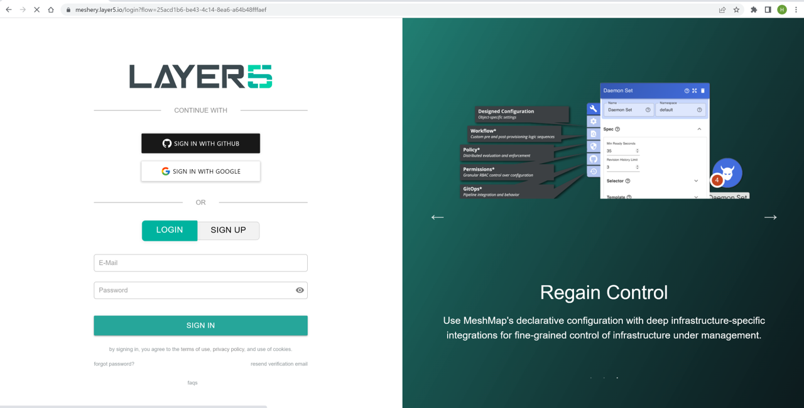

## Configure Connection to Kubernetes

Meshery attempts to auto detect your kubeconfig if it is stored in the default path ($HOME/.kube) on your system. In most deployments, Meshery will automatically connect to your Kubernetes cluster. If your config has not been auto-detected, or you want to connect remote Kubernetes cluster, you can manually locate and upload your kube config file and select the context name (docker-desktop, kind-clsuter, minikube etc.)

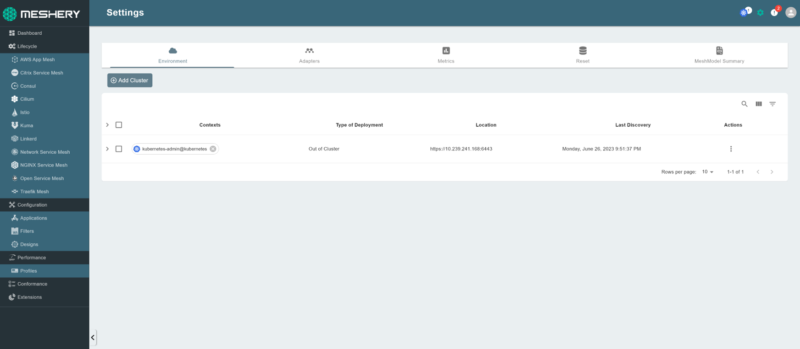

## Meshery Design 

Meshery Designs contain patterns and configurations that describe how we will deploy Istio.
Currently, we have published two Meshery Designs in Meshery Catalog website which you can import and deploy using Meshery directly:
- [CRYPTOMB-TLS-HANDSHAKE-ACCELERATION-FOR-ISTIO](https://raw.githubusercontent.com/meshery/meshery.io/master/catalog/28715e69-c6c1-4f96-bfa2-05113b00bae0.yaml): 

    CryptoMB means using Intel® Advanced Vector Extensions 512 (Intel® AVX-512) instructions using a SIMD (single instruction, multiple data) mechanism. Up to eight RSA or ECDSA operations are gathered into a buffer and processed at the same time, providing potentially improved performance. Intel AVX-512 instructions are available on recently launched 3rd generation Intel Xeon Scalable processor server processors, or later. With this Meshery Design, you can install Istio and enable CryptoMB to achieve performance improvements and accelerated handshakes.

- [QAT-TLS-HANDSHAKE-ACCELERATION-FOR-ISTIO](https://raw.githubusercontent.com/meshery/meshery.io/master/catalog/05e97933-90a6-4dd3-9b29-18e78eb4d3f1.yaml):
    
    Intel® QuickAssist Technology (QAT) provides hardware acceleration to offload the security and authentication burden from the CPU, significantly improving the performance and efficiency of standard platform solutions. With this Meshery design, you can install the Intel® QAT Device Plugin and Istio and enable QAT cryptographic acceleration for the TLS handshake in the Istio ingressgateway. This design is only available for Intel® Xeon CPUs with QAT devices enabled.

### Import Meshery Design

Take the CryptoMB TLS Handshake acceleration as example, you can import its url directly from Meshery Design page:

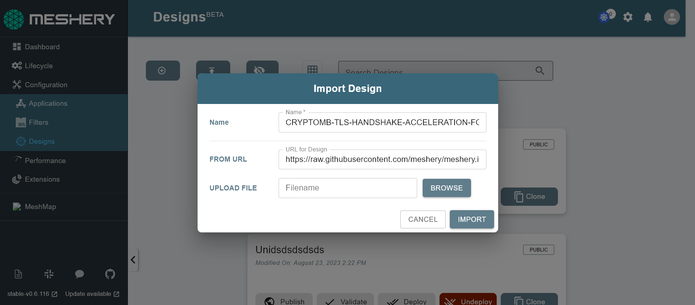

Or, you can download the design from the url and edit it as you like, then upload it to Meshery.

### Deploy Meshery Design

After importing Meshery Design, you can deploy it in the current cluster: 

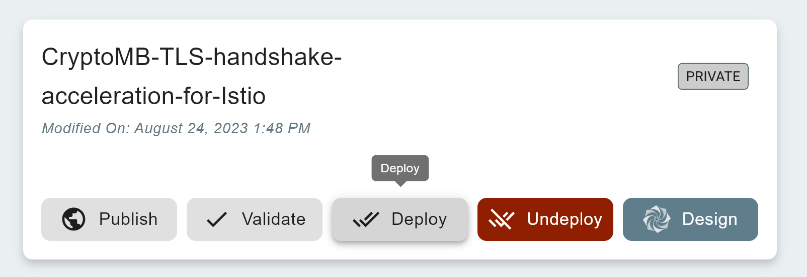

It will install Istio using Istio Operator and enable CryptoMB TLS Handshake acceleration in Istio Ingressgateway.

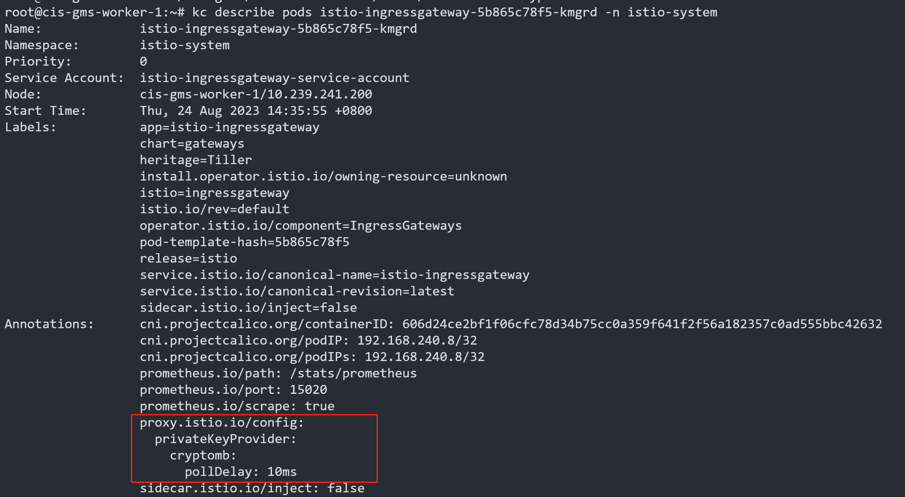

## Applications/Backend Server

You can configure automatic sidecar injection for a namespace. Then, you can deploy sample applications:

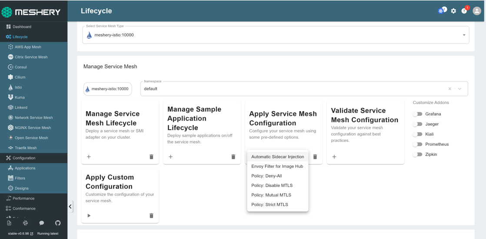
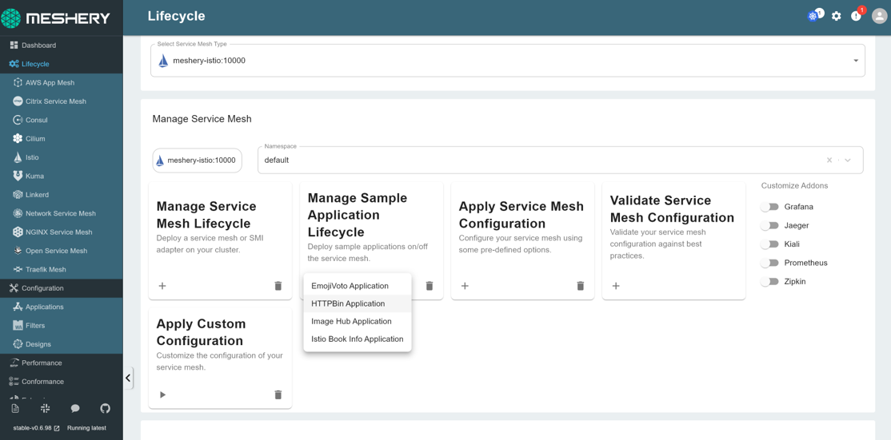

You can also import your own applications from Meshery applications page via Helm Chart, Docker Compose and Kubernetes Manifests.
Here is an example file of Kuberenetes Manifests that contains a backend server for benchmarking tests called "Fortio Server":
[fortio-server-manifests.yaml](https://raw.githubusercontent.com/intel/istio/release-1.19-intel/intel/yaml/fortio-server-manifests.yaml)

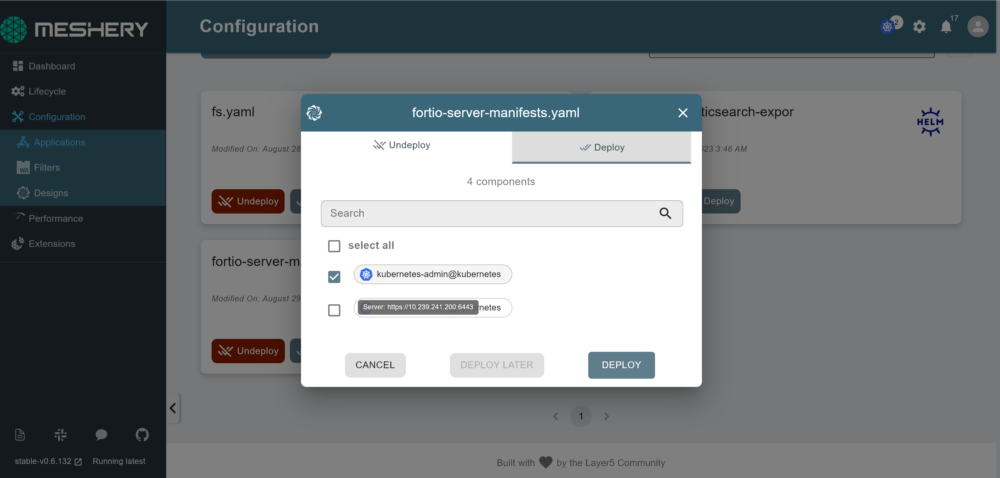
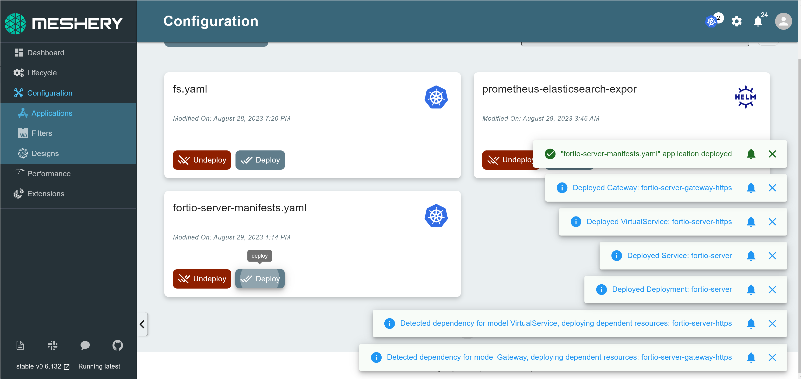

## Run a performance test

### Performance profile

Meshery UI provides an easy-to-use interface in which you can create performance profiles to run repeated tests with similar configuration and can also even schedule performance tests to be run at particular times through the calendar.

On the navigation menu, click on performance.

This will open the performance management dashboard and you can run the performance test with your own profile:


More detailes: https://docs.meshery.io/guides/performance-management

### Run a performance test with TLS enabled in Istio Ingressgateway

From above example, we use Meshery design to deploy Istio and enable CryptoMB TLS Handshake acceleration in Istio Ingressgateway.
Therefore, we need to send HTTPs requests and upload the certificate to Istio Ingressgateway. Assuming you already have a application
backbend running in Istio and exposed them with HTTPs protocul using Istio gateway. You can upload the certificate in Meshery
performance profile and run the send the HTTPs load tests as shown below:

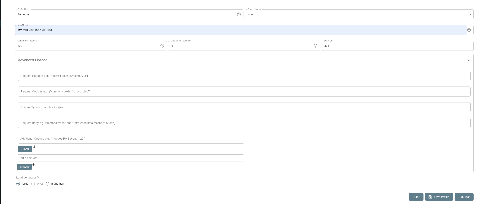

## Grafana Dashboard Integration with Meshery

> **Prerequisites:**
> 
> Prometheus and Grafana installed: https://github.com/intel/istio/blob/release-1.19-intel/intel/docs/Grafana-Dashboard.md

- Login To Grafana and retrieve API Key from Settings.
- Access Meshery UI using Meshery service LB address.
- Go to Settings http://LB-IP-address/settings#metrics -> Grafana/Prometheus
- Input address of Prometheus service in Prometheus section. Check the connectivity by pinging the address button.

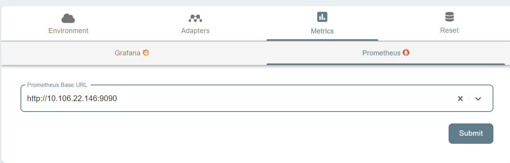

- Load custom config file of the dashboard to fetch the panels.

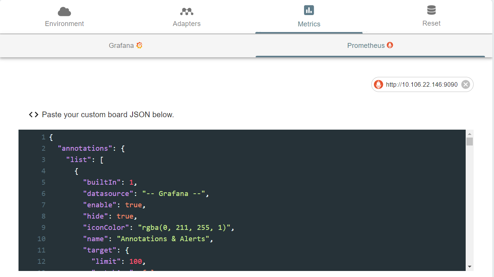

- Input address of Grafana service in Grafana section. Check the connectivity by pinging the address button.

All Grafana dashboards and its panels should appear in the menu.

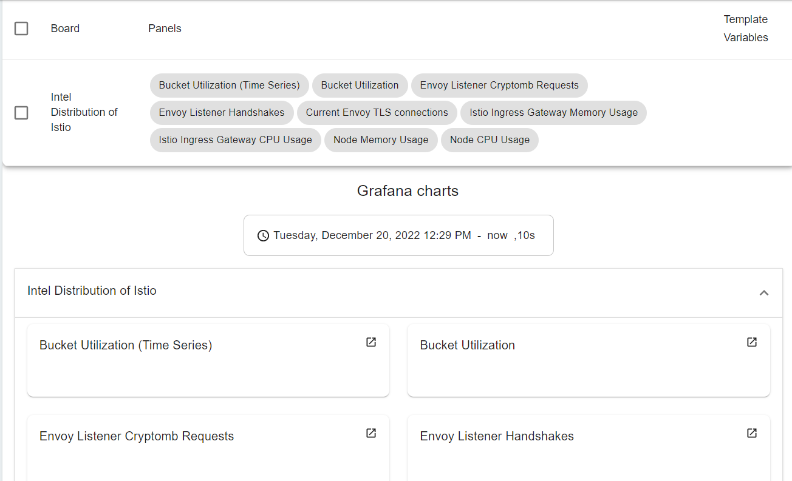

## A Preview of Meshery’s beta feature MeshMap

MeshMap which is one of the extensions of Meshery, it provides a visual way of interacting with our infrastructure through two of its modes: Designer and Visualizer.
This guide will give a preview about how to use Meshery MeshMap to drag-and-drop our designs and any other resources, deploy them to our cluster and ultimately verify
the deployment visually.

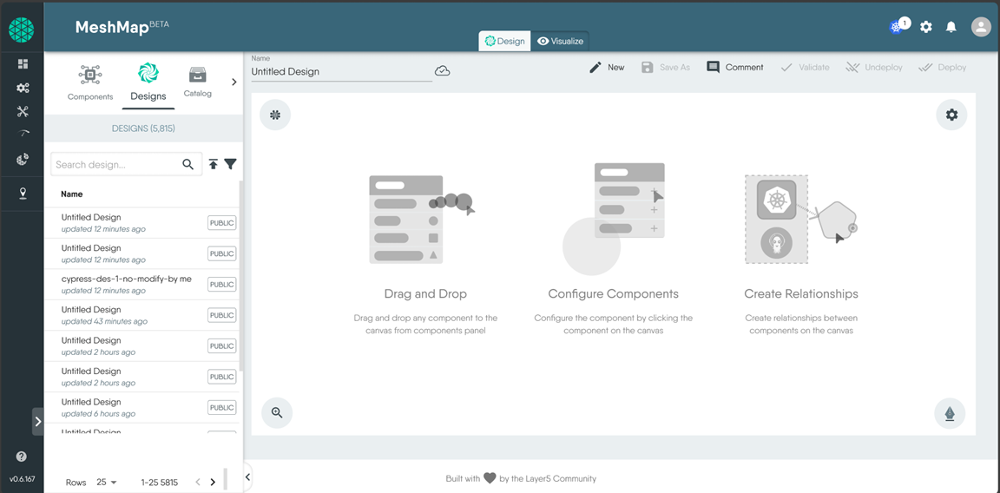

In Design page, you can create your own Meshery design by draging and droping resources or use directly design created by others. For example, you can search the desgin "QAT-TLS-handshake-acceleration-for-Istio" and you will see all the components in the design. 

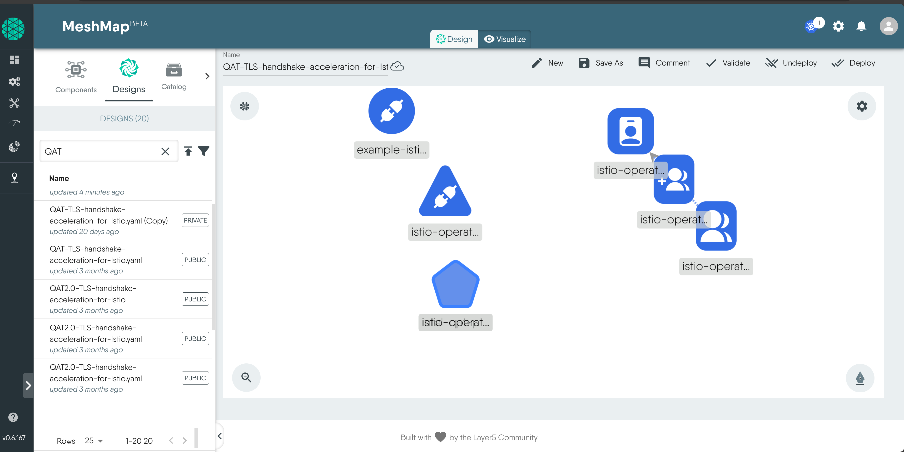

You can also merge another design into the current design. For example, you can also deploy GuestBook app design at the same time as you deploy QAT acceleration design.

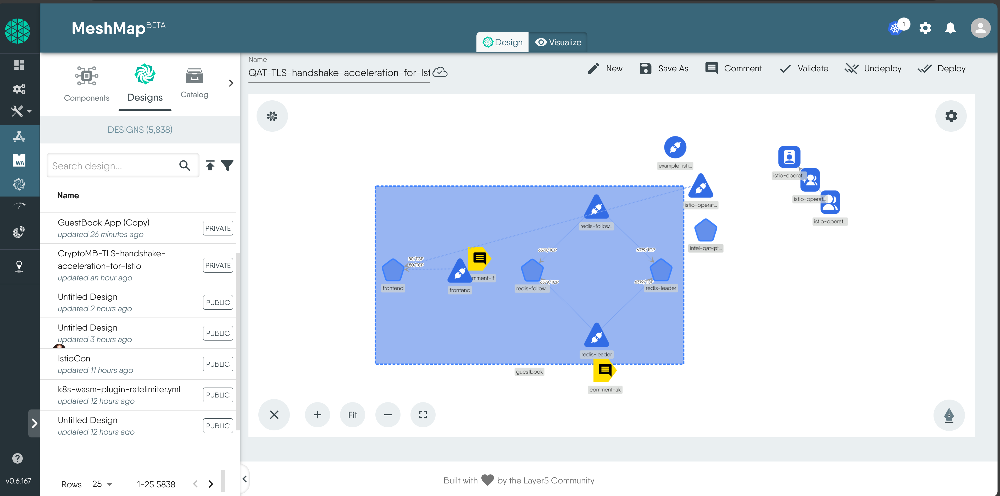

Then you can check for errors and deploy the design in cluster.

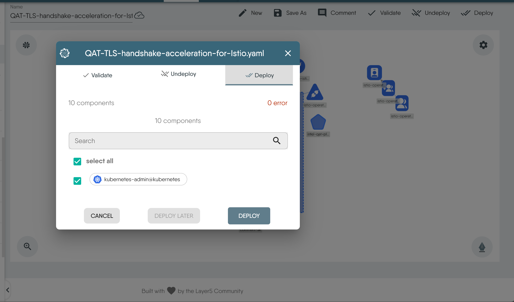

Finally, let's navigate to the Visualize page which is a readonly way of interacting with the Kubernetes environment, it gives a logically representation of the entire cluster and the resources which were discovered within its environment, you can check the deployment of design and you can also perform some actions such as starting a performance test, starting a terminal session or streams logs.

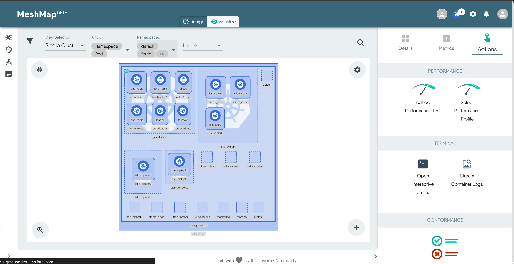


## Clean up

Clean up Meshery Design:

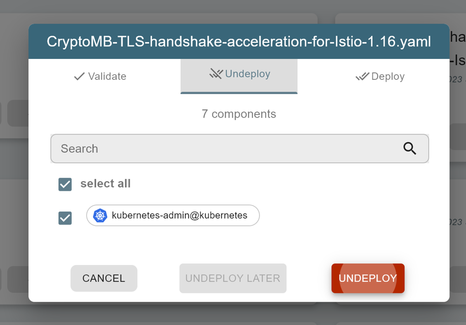

Clean up Istio:

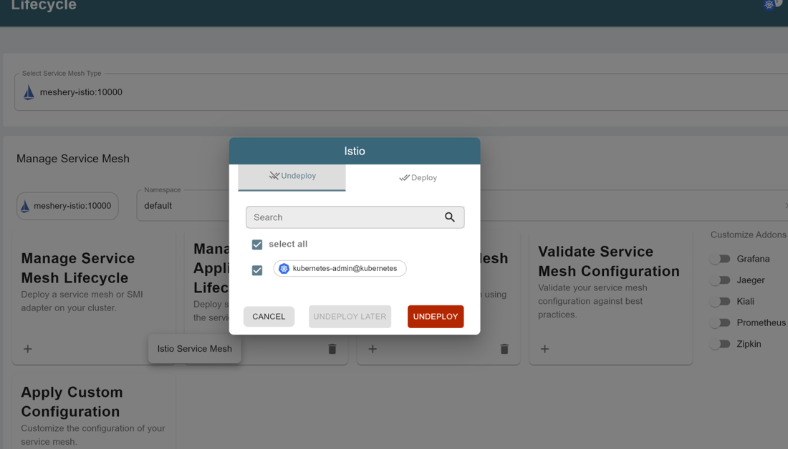

Clean up Meshery:

```
mesheryctl system stop
```

or 

```
docker-compose -f ~/.meshery/meshery.yaml down
```